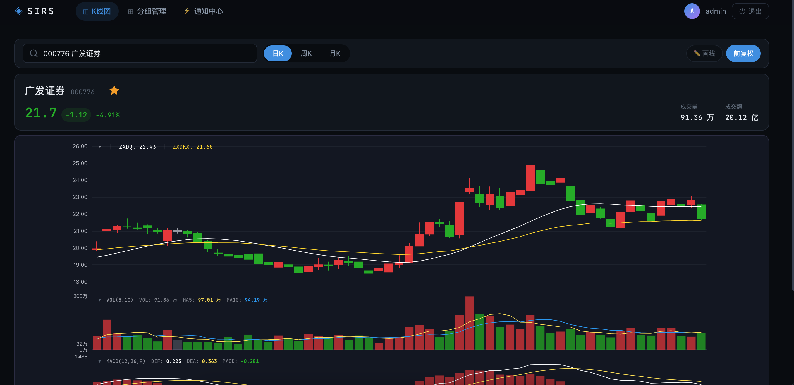
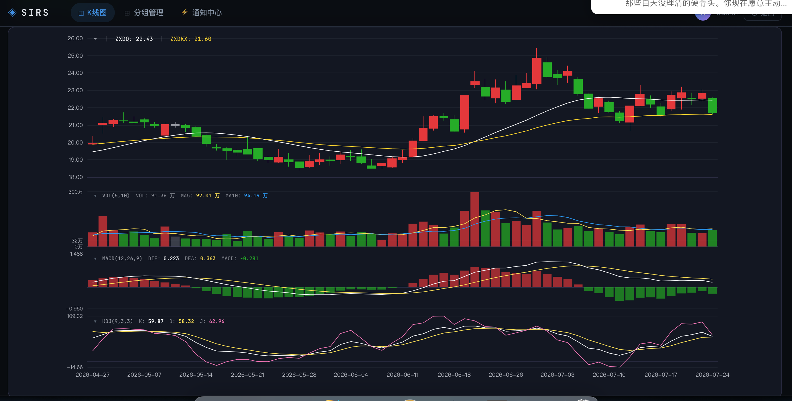
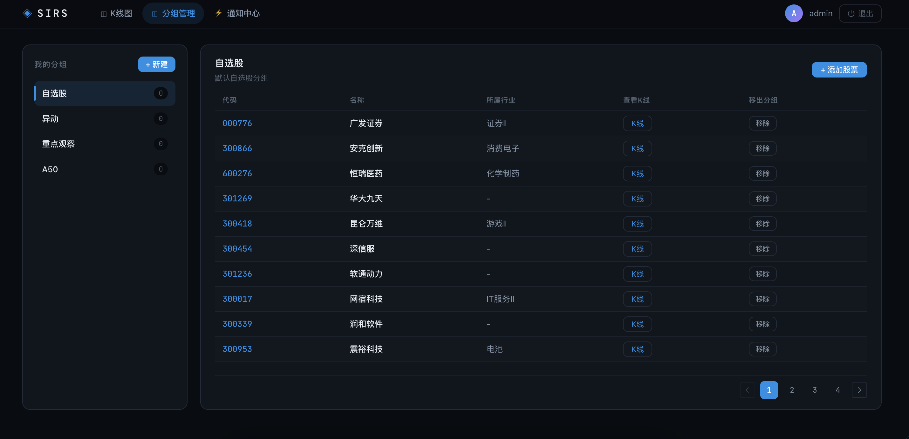
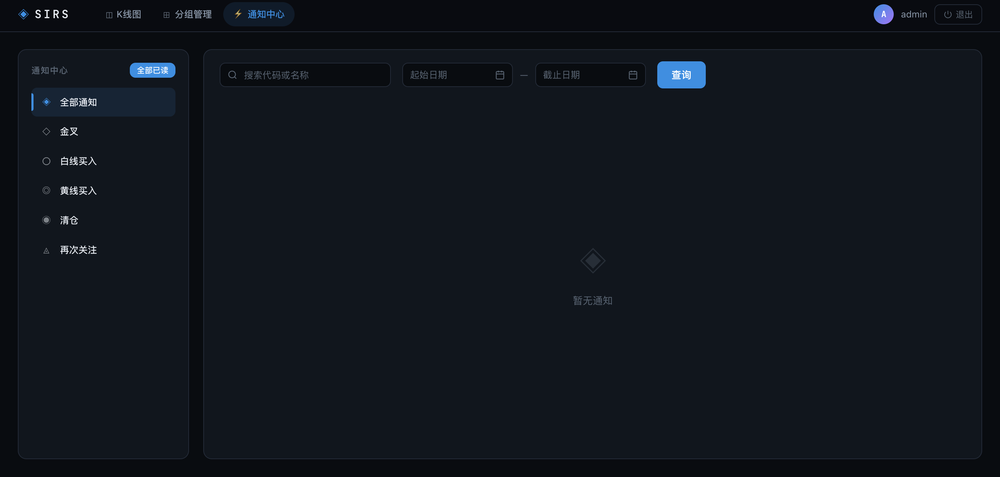
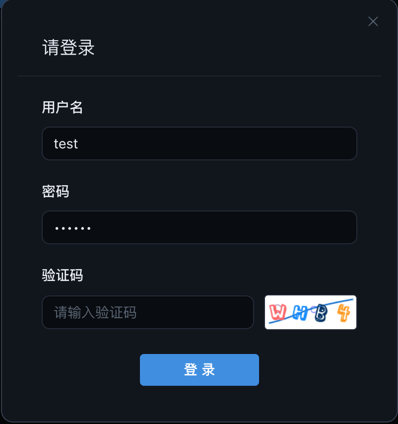
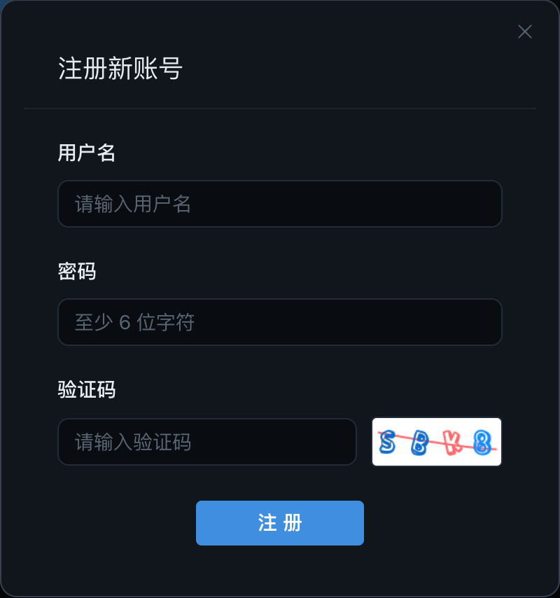

<p align="center">
  
</p>

<h1 align="center">SIRS — 股票信息与研究系统</h1>

<p align="center">
  <strong>Stock Information & Research System</strong>
</p>

<p align="center">
  
  
  
  
  
  
  
  
  
  
</p>

<p align="center">
  基于 <b>A 股实时数据</b> 的股票分析 Web 应用，提供专业的 K 线图表、技术指标分析、股票分组管理与智能信号通知。
</p>

---

## 📸 界面预览

<table>
  <tr>
    <td width="50%"><br><em>📈 K线图主界面 — 日K线 + MA 均线 + 成交量</em></td>
    <td width="50%"><br><em>📊 技术指标与画线工具 — MACD / KDJ 多面板 + 趋势线绘制</em></td>
  </tr>
  <tr>
    <td width="50%"><br><em>📁 股票分组管理 — 自建分组，一键跳转 K 线</em></td>
    <td width="50%"><br><em>🔔 智能通知中心 — 技术信号实时推送，分类筛选</em></td>
  </tr>
  <tr>
    <td width="50%"><br><em>🔐 登录 — 验证码 + JWT 认证</em></td>
    <td width="50%"><br><em>📝 注册 — 快速创建账户，即刻使用</em></td>
  </tr>
</table>

---

## ✨ 功能特性

- **📈 专业 K 线图表** — 基于 ECharts 的交互式 K 线图，支持日K / 周K / 月K 多周期切换，鼠标悬停查看 OHLCV 详情
- **📉 丰富技术指标** — 内置 MA（可自定义周期）、MACD、KDJ、ZXDQ（知行多空）、ZXDKX（知行多空看线）等多种指标
- **🔄 前复权支持** — 一键切换前复权/不复权模式，保证历史价格连续性
- **✏️ 交互式画线工具** — 支持直线、V 形、倒 V 形、竖直段等多种图形绘制，自动保存至服务器
- **📁 股票分组管理** — 自定义分组管理自选股，快速切换查看
- **🔔 智能信号通知** — 基于 ZXDQ/ZXDKX/KDJ 状态机的自动监控，推送金叉/白线买入/黄线买入/清仓/再次关注等信号
- **🔐 用户认证系统** — 注册/登录 + 图形验证码 + JWT 令牌认证

---

## 🏗 技术栈

| 层级 | 技术 | 说明 |
|------|------|------|
| **前端** | Vue 3.5 + TypeScript | Composition API + `<script setup>` |
| | ECharts 5.5 | 专业图表引擎，支持多面板 K 线图 |
| | Element Plus 2.8 | 企业级 UI 组件库，深色主题 |
| | Pinia 2 | 状态管理 |
| | Axios | HTTP 请求，自动携带 JWT |
| | Vite 5 | 构建工具，开发服务器 |
| **后端** | Java 21 + Spring Boot 3.3 | 三层架构 REST API |
| | MyBatis-Plus 3.5 | ORM 框架，操作 PostgreSQL |
| | JJWT 0.12 | JWT 生成与验证 |
| | Bucket4j 8 | 接口限流 |
| | java.net.http.HttpClient | 调用 TDengine REST API |
| **数据管道** | Python 3.12 | 数据采集与处理 |
| | mootdx / akshare | 通达信行情数据源（TCP 直连） |
| | psycopg2 | PostgreSQL 写入 |
| | taos-ws-py / urllib | TDengine 写入与查询 |
| **基础设施** | PostgreSQL 16 | 元数据存储（用户、股票、分组、通知） |
| | TDengine 3.3 | 时序数据库（K 线 OHLCV 数据存储） |
| | Redis 7 | 缓存（K 线数据、验证码、画线、JWT） |
| | Docker Compose | 一键部署基础设施 |

---

## 🧠 系统架构

```
                    ┌─────────────────────────────────┐
                    │     通达信行情服务器 × 20        │
                    │    (mootdx TCP 直连协议)          │
                    └──────────┬──────────────────────┘
                               │
                    ┌──────────▼──────────────────────┐
                    │      Python 数据管道              │
                    │                                  │
                    │  init_stocks.py     初始化全量导入 │
                    │  daily_sync.py      每日增量同步   │
                    │  calc_indicators.py  前复权+指标预计算│
                    │  scan_notifications.py 信号扫描通知 │
                    │  sync_xdxr.py       除权除息同步    │
                    │  backfill_klines.py  历史数据补全   │
                    │  sync_industry.py   行业分类同步    │
                    └───────┬──────────┬───────────────┘
                            │          │
                    ┌───────▼──┐ ┌─────▼────────────┐
                    │PostgreSQL│ │    TDengine       │
                    │          │ │                   │
                    │ stocks   │ │ kline_1d 超级表    │
                    │ users    │ │ k_1d_{code} 子表   │
                    │ groups   │ │ k_1d_adj_{code}   │
                    │ group_   │ │ (前复权+预计算指标)  │
                    │ stocks   │ │                   │
                    │ notifi-  │ │                   │
                    │ cations  │ │                   │
                    │ xdxr_    │ │                   │
                    │ events   │ │                   │
                    └──────┬───┘ └────┬──────────────┘
                           │          │
                    ┌──────▼──────────▼──────────────┐
                    │    Java Spring Boot 后端 :8080   │
                    │                                  │
                    │  AuthController   认证接口        │
                    │  StockController  股票+K线接口    │
                    │  GroupController  分组管理接口     │
                    │  NotificationController 通知接口  │
                    │  DrawingController 画线持久化接口  │
                    │                                  │
                    │  KlineServiceImpl → TDengine REST │
                    │  (指标计算: MA/MACD/KDJ/ZXDQ/ZXDKX)│
                    │  Redis 缓存 K 线 + Captcha        │
                    └────────────────┬─────────────────┘
                                     │
                    ┌────────────────▼─────────────────┐
                    │    Vue 3 SPA 前端 :5173            │
                    │    (Vite 代理 /api → :8080)        │
                    │                                   │
                    │  KlineView   K线图 (4面板+画线工具) │
                    │  GroupsView  分组管理               │
                    │  NotificationsView  通知中心         │
                    │  Login/RegisterDialog  认证弹框     │
                    └──────────────────────────────────┘
```

### 数据流说明

1. **Python 数据管道** 通过 `mootdx` 库直连通达信行情 TCP 服务器，获取全量 A 股列表、日K线、除权除息事件
2. **元数据**（股票列表、用户、分组、通知）存储在 **PostgreSQL** 中
3. **时序数据**（K 线 OHLCV）写入 **TDengine** 超级表 `kline_1d`，每只股票独立子表 `k_1d_{code}`
4. **Java 后端** 通过 MyBatis-Plus 操作 PostgreSQL，通过 `java.net.http.HttpClient` 调用 TDengine REST API（:6041）获取 K 线数据
5. **指标计算** 在后端实时计算（周K/月K 聚合）或从前复权子表中直接读取预计算指标
6. **前端** 通过 Axios 请求 Java REST API，使用 ECharts 渲染交互式 K 线图表

---

## 🚀 快速开始

### 前置条件

| 工具 | 版本要求 | 用途 |
|------|----------|------|
| [Docker Desktop](https://www.docker.com/products/docker-desktop/) | 最新版 | 运行 PostgreSQL / TDengine / Redis |
| [JDK](https://jdk.java.net/21/) | 21+ | 编译运行 Java 后端 |
| [Maven](https://maven.apache.org/) | 3.8+ | Java 项目构建 |
| [Node.js](https://nodejs.org/) | 18+ | 运行前端 |
| [Python](https://www.python.org/) | 3.12 | 运行数据管道脚本（建议 pyenv 管理） |

### 1️⃣ 启动基础设施

```bash
# 启动 PostgreSQL + TDengine + Redis（需要 Docker Desktop）
docker compose up -d

# 确认三个容器均已正常运行
docker compose ps
```

预期输出应显示三个服务状态均为 `Up`（healthy）：

```
NAME             STATUS
sirs-postgres    Up (healthy)
sirs-tdengine    Up
sirs-redis       Up (healthy)
```

> 💡 首次启动 TDengine 可能需要 10~20 秒完成初始化，耐心等待即可。

### 2️⃣ 初始化数据管道

```bash
cd data-pipeline

# 创建 Python 虚拟环境并安装依赖
python3.12 -m venv venv
source venv/bin/activate
pip install -r requirements.txt
```

#### 2a. 导入 PostgreSQL 表结构

`schema.sql` 需要手动执行一次，建好 `users`、`stocks`、`groups` 等全部业务表：

```bash
docker exec -i sirs-postgres psql -U sirs -d sirs < ../backend/src/main/resources/schema.sql
```

#### 2b. 全量导入 A 股数据

```bash
# 导入全量 A 股列表 + 历史日K线（~5200 只股票，每只最近 800 个交易日）+ 除权除息事件
python init_stocks.py
```

> ⏱ 全量导入耗时约 15~30 分钟，脚本内置断点续传机制，中断后重新运行会自动跳过已完成的股票。

#### 2c. 补全全部历史 K 线（关键步骤）

```bash
# 补全每只股票从上市以来的全量日K线数据（默认 800 条之外的早期数据）
python backfill_klines.py --skip-recent 0
```

> ⏱ 全量补全约 5000 只股票，耗时 1~2 小时。有断点续传，中断可重跑。
>
> ⚠️ **必须先补全历史数据，再算前复权指标**，否则早期除权除息事件会被跳过，导致前复权价格计算错误。

#### 2d. 前复权指标预计算

```bash
# 第1步：创建 TDengine 超级表 kline_1d_adj（仅建表，不含数据）
python calc_indicators_rest.py --init

# 第2步：遍历全部股票，计算前复权价格 + MA/MACD/KDJ/ZXDQ/ZXDKX 并写入
python calc_indicators_rest.py --all
```

> `--init` 只建表，`--all` 才是真正的全量计算写入。分开两步是因为建表只需执行一次，后续除权除息后重算只需跑 `--all`。支持 `--code 000001` 单只重算和 `--resume` 断点续传。

### 3️⃣ 启动 Java 后端

```bash
cd backend
mvn spring-boot:run
```

后端启动后监听 `http://localhost:8080`，可通过 `curl` 快速验证：

```bash
curl http://localhost:8080/api/stocks/search?keyword=平安
```

正常返回：

```json
{"code": 0, "msg": "success", "data": [...], "timestamp": 1752864000}
```

### 4️⃣ 启动前端

```bash
cd frontend
npm install
npm run dev
```

开发服务器启动后访问 `http://localhost:5173`，Vite 自动将 `/api` 请求代理至后端 `:8080`。

---

## 📜 数据管道脚本参考

| 脚本 | 用途 | 执行频率 | 关键参数 |
|------|------|----------|----------|
| `init_stocks.py` | 一建初始化：建表 + 导入全量 A 股 + 历史 K 线 | **首次部署运行一次** | `--kline-only` 仅导K线；`--sync-xdxr` 仅同步除权除息 |
| `daily_sync.py` | 每日收盘后增量同步：新股/更名/退市检测 + 日K线 | **每个交易日 15:40** | `--date 2025-01-15` 指定日期；`--sync-xdxr` 同步除权除息+重算指标 |
| `calc_indicators_rest.py` | 前复权 K 线指标预计算（MA/MACD/KDJ/ZXDQ/ZXDKX）。`--init` 建表，`--all` 全量计算 | 首次运行 + 除权除息后 | `--init` 建超级表；`--all` 全量计算；`--code 000001` 单只；`--resume` 断点续传 |
| `scan_notifications.py` | 扫描自选股，基于状态机检测买卖信号并生成通知 | 每个交易日收盘后 | `--user 1` 指定用户；`--dry-run` 试运行不写入 |
| `sync_xdxr.py` | 同步除权除息事件到 PG | 按需运行 | `--code 000001` 单只股票 |
| `backfill_klines.py` | 补全 800 天之前的全部历史 K 线数据（**必须在前复权之前运行**） | 首次部署必跑 | `--code 000001` 单只；`--max-chunks 3`；`--dry-run` |
| `sync_industry.py` | 从新浪财经同步行业分类数据 | 按需运行 | 无参数 |

### 日常使用流程

```bash
cd data-pipeline
source venv/bin/activate

# 每日收盘后（建议 crontab 15:40）
python daily_sync.py --sync-xdxr

# 扫描通知（每日收盘后）
python scan_notifications.py
```

---

## 🔌 API 接口概览

所有接口返回统一格式：

```json
{"code": 0, "msg": "success", "data": {}, "timestamp": 1752864000}
```

错误码：`0` 成功，`1xxx` 系统错误，`2xxx` 用户错误，`3xxx` 股票错误，`4xxx` 分组错误，`5xxx` 通知错误。

### 认证接口

| 方法 | 路径 | 说明 | 认证 |
|------|------|------|------|
| `GET` | `/api/auth/captcha` | 获取验证码（返回 base64 图片 + captchaId） | ❌ |
| `POST` | `/api/auth/register` | 注册新用户（限流：1 req/s, 5 req/min） | ❌ |
| `POST` | `/api/auth/login` | 登录，返回 JWT 令牌 | ❌ |

### 股票 & K 线接口

| 方法 | 路径 | 说明 | 认证 |
|------|------|------|------|
| `GET` | `/api/stocks/search?keyword=` | 搜索股票（按代码/名称模糊匹配） | ❌ |
| `GET` | `/api/stocks/{code}` | 获取单只股票信息 | ❌ |
| `GET` | `/api/kline/{code}?period=daily&from=&to=&adjusted=true` | 获取 K 线数据（支持日K/周K/月K 和前复权） | ❌ |

### 分组接口（需认证）

| 方法 | 路径 | 说明 |
|------|------|------|
| `GET` | `/api/groups` | 获取我的分组列表 |
| `POST` | `/api/groups` | 创建分组 |
| `PUT` | `/api/groups/{id}` | 更新分组信息 |
| `DELETE` | `/api/groups/{id}` | 删除分组 |
| `GET` | `/api/groups/{id}/stocks` | 获取分组中的股票列表 |
| `POST` | `/api/groups/{id}/stocks` | 向分组添加股票 |
| `DELETE` | `/api/groups/{id}/stocks/{code}` | 从分组移除股票 |

### 通知接口（需认证）

| 方法 | 路径 | 说明 |
|------|------|------|
| `GET` | `/api/notifications?page=&size=&type=&keyword=&dateFrom=&dateTo=` | 分页查询通知 |
| `GET` | `/api/notifications/stats` | 获取各类通知统计（未读/总数） |
| `PUT` | `/api/notifications/{id}/read` | 标记单条通知为已读 |
| `PUT` | `/api/notifications/read-all` | 标记全部通知为已读 |

### 画线接口（需认证）

| 方法 | 路径 | 说明 |
|------|------|------|
| `GET` | `/api/drawings/{stockCode}` | 获取某只股票的画线数据 |
| `PUT` | `/api/drawings/{stockCode}` | 保存画线数据 |
| `DELETE` | `/api/drawings/{stockCode}` | 删除画线数据 |

---

## 📁 项目结构

```
sirs/
├── docker-compose.yml          # 基础设施编排（PG + TDengine + Redis）
├── CLAUDE.md                   # AI 辅助开发指引
├── README.md                   # 本文件
│
├── backend/                    # Java Spring Boot 后端
│   ├── pom.xml
│   └── src/main/java/com/sirs/
│       ├── SirsApplication.java
│       ├── config/             # 全局配置、拦截器注册、异常处理
│       ├── controller/         # REST 控制器层
│       │   ├── AuthController.java
│       │   ├── StockController.java
│       │   ├── GroupController.java
│       │   ├── NotificationController.java
│       │   └── DrawingController.java
│       ├── dto/                # 数据传输对象 & 响应封装
│       │   ├── Result.java     # 统一 API 响应 {code, msg, data, timestamp}
│       │   └── ErrorCode.java  # 错误码定义
│       ├── entity/             # MyBatis-Plus 实体
│       ├── interceptor/        # AuthInterceptor + RateLimitInterceptor
│       ├── mapper/             # MyBatis-Plus Mapper
│       ├── service/            # Service 接口 + 实现
│       │   └── impl/
│       │       └── KlineServiceImpl.java  # TDengine REST 查询 + 指标计算
│       └── util/
│           └── JwtUtil.java    # JWT 工具类
│
├── frontend/                   # Vue 3 + TypeScript 前端
│   ├── package.json
│   ├── vite.config.ts          # Vite 配置（/api 代理至 :8080）
│   └── src/
│       ├── main.ts             # 应用入口（ElementPlus + Pinia + Router）
│       ├── App.vue             # 根布局（导航栏 + 登录/注册弹框）
│       ├── api/index.ts        # Axios 实例 + 全部 API 函数
│       ├── stores/auth.ts      # Pinia 认证状态管理
│       ├── router/index.ts     # 路由配置
│       ├── composables/        # 可组合逻辑
│       │   ├── useKlineData.ts     # K 线数据加载
│       │   ├── useChart.ts         # ECharts 实例管理
│       │   ├── useStockSearch.ts   # 股票搜索
│       │   ├── useGroupManager.ts  # 分组管理
│       │   ├── useNotifications.ts # 通知管理
│       │   ├── useDrawingTool.ts   # 画线工具
│       │   └── useFormat.ts        # 格式化/指标计算工具
│       ├── views/              # 页面组件
│       │   ├── KlineView.vue       # K 线图主页面
│       │   ├── GroupsView.vue      # 分组管理页面
│       │   └── NotificationsView.vue # 通知中心页面
│       └── components/         # 通用组件
│           ├── LoginDialog.vue
│           ├── RegisterDialog.vue
│           └── DrawingPanel.vue
│
├── data-pipeline/              # Python 数据管道
│   ├── requirements.txt
│   ├── config.py               # 数据库 + TDX 服务器配置
│   ├── init_stocks.py          # 全量导入
│   ├── daily_sync.py           # 每日增量同步
│   ├── calc_indicators.py      # 前复权指标计算（taosws）
│   ├── calc_indicators_rest.py # 前复权指标计算（HTTP REST）
│   ├── scan_notifications.py   # 信号扫描通知
│   ├── sync_xdxr.py            # 除权除息同步
│   ├── backfill_klines.py      # 历史数据补全
│   └── sync_industry.py        # 行业分类同步
│
└── img/                        # 截图资源
    ├── image1.png
    ├── image2.png
    ├── image3.png
    ├── image4.png
    ├── image5.png
    └── image6.png
```

---

## ⚙️ 配置参考

| 配置项 | 默认值 | 说明 |
|--------|--------|------|
| PostgreSQL | `localhost:5432` / `sirs` / `sirs:sirs123` | 元数据存储 |
| TDengine REST | `localhost:6041` / `root:taosdata` | 时序数据查询 |
| Redis | `localhost:6379` | 缓存 / 验证码 / 画线 |
| Java 后端端口 | `8080` | — |
| Vite 前端端口 | `5173` | 开发服务器 |
| JWT 密钥 | `sirs-jwt-secret-key-...64-bytes-long` | ⚠️ 生产环境务必修改 |
| JWT 过期时间 | 7 天 | — |
| 注册限流 | 1 req/s, 5 req/min per IP | 仅 `/api/auth/register` |

---

## 🧩 关键设计决策

**为什么使用 TDengine 而非 PostgreSQL 存储 K 线？**
- K 线是典型的时间序列数据，TDengine 的列式压缩和 `INTERVAL` 聚合查询在效率上有数量级优势
- 周K/月K 数据通过 SQL 的 `INTERVAL(1w)` / `INTERVAL(1mo)` 实时聚合，无需额外存储

**为什么区分原始 K 线与前复权 K 线两张表？**
- `k_1d_{code}` 存储通达信原始不复权数据，保证数据源的可追溯性
- `k_1d_adj_{code}` 存储前复权处理后的数据 + 预计算技术指标，加速前端查询

**后端实时计算 vs 预计算**
- 不复权模式下，MA/MACD/KDJ/ZXDQ/ZXDKX 由 `KlineServiceImpl` 在后端实时计算
- 前复权模式下，指标由 `calc_indicators_rest.py` 预计算写入 `k_1d_adj` 子表，查询时直接读取

---

## 🤝 贡献指南

1. Fork 本项目
2. 创建特性分支 (`git checkout -b feature/amazing-feature`)
3. 提交变更 (`git commit -m 'feat: add some amazing feature'`)
4. 推送到分支 (`git push origin feature/amazing-feature`)
5. 提交 Pull Request

提交信息请遵循 [Conventional Commits](https://www.conventionalcommits.org/) 规范。

---

## 📄 License

[MIT](LICENSE)

---

<p align="center">
  <sub>Built with ❤️ by SIRS Team</sub>
</p>
